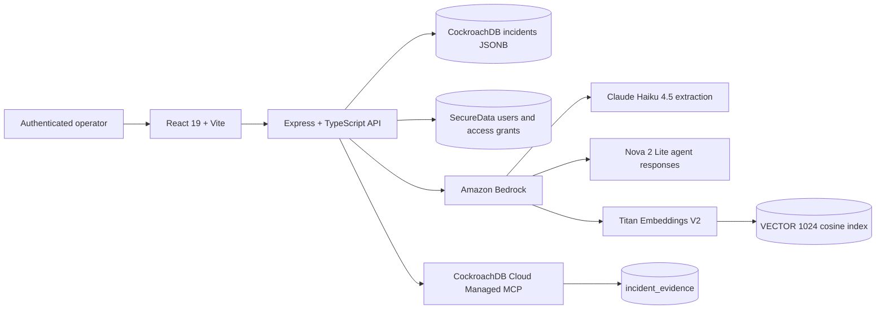

# OpsRelay Complete Application Workflow Audit

**Audit date:** 2026-08-08 (America/New_York)  
**Live deployment:** `http://18.232.197.149/` on AWS EC2  
**Repository:** `/Users/yashkishorsanap/Documents/opsrelay`  
**Latest reviewed remote commit:** `2d1ca69d2b5312b4832f67dc7fdf4d689e5a8ca4` (`origin/main`, 2026-08-08 20:13:25 -04:00)  
**Local checkout:** `main` at `851a6183a23b318844779e116877f4f63b8290e8`, seven commits behind the reviewed remote  
**Browser:** Chrome through Codex Browser/Playwright control  
**Test incident:** `INC-5869FBD3`, created with the marker `TEST-CODEX-20260808-OPSRELAY-AUDIT`  

No source code, database schema, cloud configuration, IAM permissions, commits, or branches were changed. One clearly labeled incident was created and approved, and one of its tasks was moved to In Progress as required by the audit. No production records were deleted. No external messages were sent.

## Executive Summary

**Overall demo readiness: FAIL**  
**Can the 5–7 minute demo be run reliably? No.**  
**Biggest blocker:** Managed MCP queries are not scoped to the authenticated member. A live query returned evidence for incident IDs that were not in the audit account's accessible incident list. The code confirms MCP evidence SQL filters by service but not by owner/member scope.

The core technical story is substantially real:

- Incident notes receive a persistent CockroachDB ID before Bedrock analysis completes.
- Bedrock produced a relevant structured payment incident draft.
- Human edits to summary and severity persisted.
- Approved timeline, decisions, remediation, and tasks survived refresh.
- Titan/CockroachDB vector indexing increased the live embedding count from 503 to 512 and reports 1,024 dimensions.
- A real CockroachDB Cloud Managed MCP `select_query` returned evidence cards and changed health from not configured/cold to ready.
- Task status persisted after refresh.

However, the deployment is not safe or reliable enough for a public hackathon demo:

1. The public site has no HTTPS listener. Login credentials, JWT traffic, incident notes, and AI results traverse plain HTTP.
2. Managed MCP has a confirmed cross-user evidence leak.
3. A visually editable title is silently discarded during approval.
4. The handoff omits the task's In Progress state and has no citations.
5. Some MCP citation buttons silently do nothing.
6. MCP/Bedrock synthesis emitted uncited operational commands, including a rollback command and a fabricated metrics endpoint.
7. Extracted task IDs repeat across incidents (`tsk-0`, `tsk-1`, ...), making updates ambiguous and capable of targeting the wrong incident.
8. Vector results mix keyword scoring with vector results and presented unrelated records as 100% matches.
9. Background job idempotency records success before the side effect runs; a transient failure can permanently skip indexing/evidence/alert work.

### Result counts

| Status | Count |
|---|---:|
| Pass | 30 |
| Fail | 10 |
| Partial | 6 |
| Blocked | 8 |
| **Total** | **54** |

## Implemented Architecture

The repository does **not** implement the FastAPI architecture described in parts of the project context. The current application is:



- Frontend: React 19, TypeScript, Vite.
- Backend: Express/Node/TypeScript, not FastAPI.
- Incident persistence: JSONB records in CockroachDB.
- Authentication: JWT-backed users stored separately in SecureData.
- Extraction: Bedrock Claude Haiku 4.5.
- Agent response: Bedrock Nova 2 Lite.
- Embeddings: Titan Text Embeddings V2, configured and validated at 1,024 dimensions.
- Vector search: CockroachDB `<=>` cosine distance over `incident_embeddings`.
- Managed MCP: MCP SDK Streamable HTTP client calling CockroachDB Cloud `select_query`.
- Workspace model: member ownership, explicit incident sharing, and owner-level access grants. There is no workspace/organization/tenant entity.
- Tasks: embedded inside each incident's JSON document, not a separate task table.
- Handoff: generated client-side Markdown; not persisted and not produced by a separate AI/handoff API.

## Demo Workflow Results

### Step 1 — Open HTTPS URL

**Expected:** Valid HTTPS without certificate warnings.  
**Actual:** `https://18.232.197.149/` refused port 443. The working deployment is plain HTTP and Chrome labels it Not Secure.  
**Result:** FAIL, P0.  
**Evidence:** `curl -kIsS --max-time 10 https://18.232.197.149/` failed to connect to port 443.  
**Code path:** EC2/Nginx/deployment configuration, outside React business logic.

### Step 2 — Sign in

**Expected:** Prepared demo credentials authenticate and refresh preserves the session.  
**Actual:** An existing authenticated prepared session worked and survived refresh. Unauthenticated `GET /api/incidents` returned 401. The credentials documented in `docs/DEMO_FLOW.md` did not authenticate.  
**Result:** PARTIAL.  
**Evidence:** Protected dashboard loaded for the prepared account; unauthenticated API response was `401 {"error":"Authentication required"}`.  
**Code path:** `server/routes/auth.ts`, authentication middleware, `src/components/auth/LoginPage.tsx`.

### Step 3 — New Incident → AI Extract

**Expected:** Accept the payment incident and begin the AI workflow.  
**Actual:** Passed. The form accepted the full labeled notes and disabled editing during analysis.  
**Result:** PASS.  
**Evidence:** Browser displayed the complete marker and payment notes in the disabled Raw log input after submission.  
**Code path:** `src/components/intake/NotesForm.tsx` → `src/App.tsx:218-260`.

### Step 4 — Save & Analyze

**Expected:** Persist the incident before Bedrock finishes.  
**Actual:** Passed. The UI immediately displayed: `Incident saved as INC-5869FBD3 — Bedrock is still analyzing. Your notes are already persisted in CockroachDB.`  
**Result:** PASS.  
**Evidence:** The persistent ID appeared while the button still read Saving & analyzing.  
**Code path:** `src/App.tsx:224-241` calls `createIntakeIncident` before `startAnalysis`; `server/services/analysisService.ts:143-201` records a separate analysis run.

The Bedrock failure path was not disabled against the live deployment. Code marks the run and incident failed while retaining the incident, but the existing test does not exercise a mocked Bedrock failure end-to-end. That failure case remains blocked live.

### Step 5 — Bedrock Draft

**Expected:** Relevant SEV-2 payment draft with editable human-review fields.  
**Actual:** Bedrock returned a relevant payment gateway draft: 92% confidence, `payment-api`, nine timeline events, one decision, five tasks, and seven suggested fixes. It initially selected SEV-1 under the repository's guide (`SEV-1=major degradation`, `SEV-2=moderate partial impact`). The human override to SEV-2 persisted.  
**Result:** PARTIAL.  
**Evidence:** Draft referenced 18% authorization failures, 8.6-second latency, and failover to the secondary provider.  
**Code path:** `server/services/llmService.ts`, `server/schemas/extraction.ts`, `src/components/intake/ExtractionResultView.tsx`.

### Step 6 — Approve + Save Only

**Expected:** All human edits and structured values persist.  
**Actual:** Summary and severity edits persisted, but the edited Title was silently replaced with `payment-api — primary-payment-processor-gateway`. Timeline, decisions, tasks, and fixes persisted.  
**Result:** FAIL, P1.  
**Evidence:** The title field was changed to `TEST-CODEX human-reviewed payment gateway incident`; the saved detail and refreshed dashboard showed the generated service/component title.  
**Code path:** `ExtractionResultView.tsx:36,42-49,126-127` stores Title locally but omits it from `buildDraft`; `analysisService.ts:243-261` always rebuilds Title.

### Step 7 — Refresh Persistence

**Expected:** Approved data survives refresh and navigation.  
**Actual:** Incident, summary edit, severity edit, timeline, decisions, tasks, fixes, and status survived refresh. Refresh returned to Dashboard rather than the incident because navigation is React state only.  
**Result:** PASS for data, PARTIAL for navigation.  
**Evidence:** Reopened `INC-5869FBD3` after full reload with all structured data present.  
**Code path:** CockroachDB incident JSONB plus `src/App.tsx` state-only navigation.

### Step 8 — Tasks

**Expected:** Move one extracted task from Open to In Progress and retain it.  
**Actual:** The selected task moved to In Progress and remained there after refresh. Incident detail showed `IN PROGRESS`.  
**Result:** PASS for this action, with a P1 integrity risk.  
**Evidence:** The task board showed four Open and one In Progress tasks for `INC-5869FBD3`.  
**Code path:** `server/routes/tasks.ts:35-67`.

The analysis service assigns repeated IDs such as `tsk-0` to every incident. The update endpoint accepts only `taskId`, scans all incident rows, and updates the first matching ID. The live action happened to reach the intended incident, but a different row order can modify another incident.

### Step 9 — Ask AI / Vector Memory

**Expected:** Titan query embedding, VECTOR(1024) cosine search, relevant results, and honest weak-evidence behavior.  
**Actual:** Live health reported 1,024 dimensions and the embedding count increased from 503 to 512 after approval. The payment query returned relevant payment incidents, but also an auth/Redis incident and a welcome SSL incident, all labeled 100% / Very strong match. The system merges additive keyword scores with vector hits, so the displayed percentage is not reliably a vector cosine similarity.  
**Result:** PARTIAL, P1.  
**Evidence:** Four materially different records were displayed as 100%.  
**Code path:** `vectorService.ts:129-185` performs cosine search; `vectorService.ts:43-75,208-242` computes and merges saturating keyword scores; `agentService.ts:193-200` merges both.

The Redis negative question was not a true no-evidence case because the accessible corpus contains a real Redis-credential incident. The answer found that record but still repeated the linked payment incident as 100% context.

### Step 10 — Managed MCP Investigator

**Expected:** Real read-only Managed MCP with authorized, grounded citations.  
**Actual:** A real Cloud Managed MCP `select_query` ran; health became `ready`, provider `cockroachdb-cloud-managed-mcp`, and five citation cards were returned. However, evidence included incident IDs absent from the authenticated account's accessible incident list. The query SQL has no owner/member filter.  
**Result:** FAIL, P0.  
**Evidence:** Dashboard exposed eight incidents, while MCP returned excerpts for additional IDs such as `INC-IND-003` and `INC-EX-72AFEC-02`. `investigationQueries.ts:32-55` filters only by service.  
**Code path:** `investigatorService.ts:83-150` → `managedMcpClient.ts:42-84` → `investigationQueries.ts:19-57`.

The MCP tool policy allows only reviewed read tools and rejects DML/DDL in unit tests. The actual Cloud service-account SQL privileges could not be verified live without credentials or a controlled write-denial probe.

### Step 11 — Handoff Report

**Expected:** Current task statuses and citations.  
**Actual:** The report includes incident state, summary, timeline, decisions, tasks, fixes, and next steps, but the task moved to In Progress is rendered as the same unchecked item as an Open task and its status is omitted. No citations appear. It also unconditionally claims all three integrations and says it was generated by an AI agent, although it is client-side string construction.  
**Result:** FAIL, P1.  
**Evidence:** Detail showed `IN PROGRESS`; handoff Action Items rendered `- [ ]` with no status and next steps also omitted it.  
**Code path:** `src/components/detail/ExportReportModal.tsx:10-81`.

### Step 12 — Architecture Claims

**Expected:** Independent proof of CockroachDB vector indexing, Managed MCP, and Bedrock.  
**Actual:** All three integrations are implemented and were exercised live, but MCP isolation and vector score labeling are not acceptable.  
**Result:** PARTIAL.

## Answers to the Three Specific Questions

### 1. Suggested Tasks / Timeline / Decisions / Suggested Fix

These sections are an **AI-generated structured review preview**. Their non-clickable presentation is intentional in the current implementation, although the UI does not explain that clearly.

| Section | Component | Data source | Bedrock | Editable | Clickable | Expected clickable | Before approval | After approval | Database field/entity | Purpose and observed behavior |
|---|---|---|---:|---:|---:|---|---:|---:|---|---|
| Suggested Tasks | `ExtractionResultView` | `result.tasks` | Yes | No | No | No in current design | Stored only in `agent_runs.output_json`, not durable incident memory | Yes | `incidents.data.tasks` JSON | Preview extracted action items; task board becomes interactive only after approval |
| Timeline | `ExtractionResultView` | `result.timeline` | Yes | No | No | No in current design | Draft only | Yes | `incidents.data.timeline` JSON | Review chronology; displayed as read-only event cards |
| Decisions | `ExtractionResultView` | `result.decisions` | Yes | No | No | No in current design | Draft only | Yes | `incidents.data.decisions` JSON | Review extracted decisions and impact |
| Suggested Fix | `ExtractionResultView` | `result.suggestedFixes` | Yes | No | No | No in current design | Draft only | Yes | `incidents.data.fixesApplied` JSON | Review suggested remediation; it is not a separately confirmed root-cause entity |

The user can edit Title, Service, Component, Severity, and Summary. Suggested Tasks, Timeline, Decisions, and Suggested Fixes are read-only. The title input is broken because its edit is discarded. The other editable fields are sent in the approval request and persisted.

### 2. Unsaved Incident + Share

**Definitive answer:** a truly unsaved Quick Add incident cannot be seen by anyone else. Clicking the misleading `Save to DB` button first opens the share dialog; it does not write to the server until `Save only` or `Save & send` is confirmed. Closing the dialog and refreshing destroyed the test draft, and the dashboard count remained eight.

| State | Server ID | Persisted | Current user | Explicit same member recipient | Other member/workspace | Anonymous | Refresh |
|---|---:|---:|---|---|---|---|---|
| Quick Add before final confirmation | No | No | Component memory only | Cannot see | Cannot see | Cannot see | Draft lost |
| Save & Analyze before approval | Yes | Yes | Can see | Not visible unless explicitly shared | Not visible through normal incident APIs | 401 | Persists |
| Approved + Save only | Yes | Yes | Can see | Not visible unless explicitly shared/granted | Not visible through normal incident APIs | 401 | Persists |
| Approved + Save & send | Yes | Yes | Can see | Exact recipient can view, not edit | No true workspace concept; only recipient/grant logic | 401 | Persists |

There is no `workspace_id`, `tenant_id`, or `organization_id`. “Workspace” in the UI means an individual member scope. Normal incident and task APIs enforce owner/share/grant access server-side. **Managed MCP currently breaks this isolation after approval**, because evidence queries ignore owner scope.

### 3. Managed MCP

**Classification: Partially working, with a critical authorization defect.**

- Genuine Cloud Managed MCP was live verified.
- Provider: `cockroachdb-cloud-managed-mcp`.
- Actual tool: `select_query` via Streamable HTTP.
- App-side SQL policy is read-only and limited to `incident_evidence`.
- Health became `ready` after the successful call.
- Evidence cards contain real citation IDs and excerpts.
- Queries are not scoped by authenticated member/owner.
- Some citation buttons silently fail because the frontend only opens incidents already loaded into the current `incidents` array.
- The model may append operational advice not supported by citations.
- The actual MCP service-account database privileges were not live verified.

## Integration Verification

| Integration | Claimed | Implemented | Live verified | Evidence |
|---|---:|---:|---:|---|
| CockroachDB persistence | Yes | Yes | Yes | Incident, edits, task state survived refresh |
| Distributed Vector Indexing | Yes | Yes | Partial | Schema/migration uses VECTOR(1024), `vector_cosine_ops`; health reported 512 embeddings and 1,024 dimensions; live index definition not queried directly |
| Titan embeddings | Yes | Yes | Yes | Production health named Titan V2; approval increased embedding count by nine; dimension validation exists |
| Bedrock extraction | Yes | Yes | Yes | Relevant 92%-confidence draft returned for supplied notes |
| Managed MCP | Yes | Yes | Yes | Provider and citations returned live; health ready, but isolation failed |
| Authentication | Yes | Yes | Yes | Prepared session worked; unauthenticated incident API returned 401 |
| Workspace isolation | Yes | Partial member scope | No | Incident API policy exists; MCP returned evidence outside accessible incident list |

## Button and Control Audit

| Screen | Control | Expected | Actual | API call | Persistence | Result |
|---|---|---|---|---|---|---|
| Global shell | Dashboard | Open dashboard | Opened | Incident/task GETs | N/A | PASS |
| Global shell | New Incident | Open intake | Opened | None | N/A | PASS |
| Global shell | Team Chat | Open chat | Opened | Chat GETs | Server-backed | PASS |
| Global shell | Send to employee | Open sharing panel | Opened | None until send | Server-backed on send | PASS |
| Global shell | Ask AI | Open agent console | Opened | Chat history GET | Saved when Save checked | PASS |
| Global shell | Tasks | Open task board | Opened | `GET /tasks` | Server-backed | PASS |
| Global shell | Collapse sidebar | Collapse/expand | Handler and latest implementation present; desktop visual not fully remeasured | None | Local UI | PASS |
| Global shell | Open navigation | Mobile drawer | Latest code present; viewport change unavailable | None | Local UI | UNTESTABLE |
| Header | Global search | Search from any page | Filters Dashboard only; no visible effect elsewhere | None | No | FAIL |
| Header | Connected badge | Show DB state | Displays Connected after successful startup | Health/load calls | No | PASS |
| Header | New incident | Open intake | Opened | None | N/A | PASS |
| Header | Account menu | Open user menu | Opened | None | No | PASS |
| Account menu | Share access | Open grants dialog | Opened | Access APIs after submit | Server-backed | PASS |
| Account menu | Sign out | End session | Not clicked to preserve prepared session; previously verified in the same deployment family | Auth state | N/A | UNTESTABLE THIS RUN |
| Dashboard | Open incidents metric | Apply active filter | Applied Active filter | None | No | PASS |
| Dashboard | Critical metric | Apply critical filter | Handler present; not separately clicked | None | No | PASS |
| Dashboard | Open tasks metric | Open tasks | Handler present; task page independently tested | Tasks GET | N/A | PASS |
| Dashboard | Local incident search | Filter table | Correctly isolated test incident | None | No | PASS |
| Dashboard | Severity/status filters | Filter table | Correctly filtered SEV-2 Investigating | None | No | PASS |
| Dashboard | Sortable headers | Sort table | Title sort changed state | None | No | PASS |
| Dashboard | Incident row | Open detail | Opened correct incident | None | No | PASS |
| New Incident | Quick add / AI extract | Switch modes | Both modes rendered | Sample-log GET | No | PASS |
| Quick Add | Save to DB | Save immediately | Actually opens share dialog before saving | None until confirmation | No | MISLEADING / FAIL |
| Share dialog | Save only | Persist without recipient | Worked for approved incident | Incident/approval API | Yes | PASS |
| Share dialog | Save & send | Persist and share | Enabled only for valid member ID; not sent to avoid affecting another member | Share API | Yes | UNTESTABLE |
| AI intake | Sample log chips | Populate input | Existing selected sample populated | None | No | PASS |
| AI intake | Clear | Clear raw notes | Handler present; not used after labeled input | None | No | PASS |
| AI intake | Save & analyze | Save first, then analyze | Worked and disabled during request | Create incident + analysis | Yes | PASS |
| AI review | Start over | Reset workflow | Handler present; not used because it would abandon the test flow | None | Draft state | UNTESTABLE |
| AI review | Approve & finalize | Open final sharing choice | Opened | None until final confirmation | No | PASS |
| AI review | Title input | Persist human title | Edit discarded | Approval API | No | FAIL |
| AI review | Service/component/severity/summary | Persist edits | Severity and summary live verified | Approval API | Yes | PASS |
| AI review | Tasks/timeline/decisions/fixes | Preview extracted data | Read-only cards, no handlers | None | After approval | READ-ONLY BY DESIGN |
| Incident detail | Back | Return to dashboard | Returned to dashboard, not browser history | None | No | PASS |
| Incident detail | Status dropdown | Persist status | Code/API connected; not changed to avoid unnecessary mutation | Status PATCH | Yes | UNTESTABLE |
| Incident detail | Generate handoff | Generate report | Opened client-side report | None | No | PARTIAL |
| Incident detail | MCP Query | Run read-only query | Real Managed MCP result | Investigator POST | No | FAIL SECURITY |
| MCP citation | Accessible incident ID | Open source incident | Opened `INC-79D86D5B` | None; uses loaded state | No | PASS |
| MCP citation | Non-loaded incident ID | Open source incident | Silent no-op | None | No | FAIL |
| Incident detail | Raw logs | Toggle notes | Handler present; notes already inspected at intake | None | No | PASS |
| Handoff modal | Copy | Copy Markdown | Handler present; not copied to avoid overwriting clipboard | Clipboard | No | UNTESTABLE |
| Handoff modal | Download | Download Markdown | Handler present; not needed for audit | Local file | No | UNTESTABLE |
| Tasks | Board/List | Switch view | Both handlers present; Board tested | Tasks GET | No | PASS |
| Tasks | Incident filter | Limit tasks | Correctly showed 4 Open + 1 In Progress | None | No | PASS |
| Tasks | Status dropdown | Persist state | In Progress persisted after refresh | Task PATCH | Yes | PASS WITH RISK |
| Ask AI | Vector memory mode | Run vector/corpus retrieval | Returned answer and sources | Agent POST | Saved chat | PARTIAL |
| Ask AI | MCP investigator mode | Run MCP | Equivalent incident-detail MCP path verified | Investigator POST | Saved chat | PASS WITH SECURITY DEFECT |
| Ask AI | Link incident | Add active context | Linked `INC-5869FBD3` | Included in request | Saved chat | PASS |
| Ask AI | Save checkbox | Persist conversation | Saved chats appeared in DB sidebar | Chat persistence API | Yes | PASS |
| Ask AI | New chat | Clear composer thread | Handler present; not needed | None | Existing saved chats remain | PASS |
| Ask AI | Clear all chats | Delete saved history | Not clicked; destructive | Delete API | Deletes user chats | UNTESTABLE |
| Ask AI | Source Open | Open incident | Code uses loaded incident list | None | No | PARTIAL |
| Team Chat | Existing chat | Open conversation | Opened | Chat GET/read receipt | Server-backed | PASS |
| Team Chat | New chat Go | Open member chat | Disabled without valid ID | Chat API | Server-backed | PASS VALIDATION |
| Team Chat | Add guest/durations | Configure timed guest | Panel and duration controls worked | Invite only on submit | Server-backed | PASS |
| Team Chat | Invite guest | Send invitation | Not sent | Chat API | Yes | UNTESTABLE |
| Team Chat | Send message | Send external message | Not sent under safety rule | Message API | Yes | UNTESTABLE |
| Team Chat | Upload image / camera | Send media | Not invoked under safety/privacy rule | Media/message API | Yes | UNTESTABLE |
| Team Chat | Delete message/chat | Delete data | Not clicked | Delete API | Destructive | UNTESTABLE |
| Send to employee | Incident select | Choose owned incident | Listed owned incidents | None | No | PASS |
| Send to employee | Member ID validation | Reject malformed ID | Displayed format hint and disabled Send | None | No | PASS |
| Send to employee | Send incident | Share incident | Not sent to another member | Share API | Yes | UNTESTABLE |

## Test Results

| ID | Test case | Status | Severity when failed | Evidence summary |
|---|---|---|---|---|
| T01 | HTTP application load | Pass | — | Chrome rendered app |
| T02 | HTTPS/TLS load | Fail | P0 | Port 443 refused |
| T03 | Existing prepared session | Pass | — | Authenticated dashboard |
| T04 | Documented demo credentials | Fail | P1 | Live login rejected them |
| T05 | Authentication survives refresh | Pass | — | Session retained |
| T06 | Unauthenticated incidents denied | Pass | — | HTTP 401 |
| T07 | Dashboard render | Pass | — | Metrics/table loaded |
| T08 | Dashboard search/filter/sort | Pass | — | Live interaction |
| T09 | New Incident navigation | Pass | — | Intake rendered |
| T10 | Save-before-analysis | Pass | — | ID shown while Bedrock pending |
| T11 | Incident-specific Bedrock draft | Pass | — | Relevant payment extraction |
| T12 | Expected severity classification | Partial | P2 | AI chose SEV-1; human SEV-2 override persisted |
| T13 | Editable summary/severity persistence | Pass | — | Survived refresh |
| T14 | Editable Title persistence | Fail | P1 | Silently overwritten |
| T15 | Read-only extraction preview | Pass | — | Matches current component design |
| T16 | Approval data persistence | Pass | — | Structured fields present |
| T17 | Refresh persistence | Pass | — | Reopened from CockroachDB |
| T18 | Task status persistence | Pass | — | In Progress survived refresh |
| T19 | Handoff reflects task status | Fail | P1 | In Progress omitted |
| T20 | Handoff completeness/citations | Partial | P2 | No citations; client-only report |
| T21 | VECTOR(1024)/embedding growth | Pass | — | Health: 512 embeddings, 1024 dims |
| T22 | Vector relevance and score accuracy | Partial | P1 | Different records shown as 100% |
| T23 | Redis evidence query | Pass | — | Found a real Redis incident |
| T24 | Managed MCP live connectivity | Pass | — | Provider ready and citations returned |
| T25 | MCP app-side read-only policy | Pass | — | Unit tests and allowlist |
| T26 | Cloud MCP role write denial | Blocked | — | No safe service-role probe/credentials |
| T27 | MCP member isolation | Fail | P0 | Returned inaccessible incident evidence |
| T28 | Citation for loaded source | Pass | — | Correct incident opened |
| T29 | Citation for non-loaded source | Fail | P1 | Silent no-op |
| T30 | Unsaved Quick Add draft visibility | Pass | — | No ID, no persistence, lost on refresh |
| T31 | Saved-unapproved share behavior | Partial | P2 | Code allows explicit share; no second user live test |
| T32 | Recipient visibility after share | Blocked | — | No second prepared authenticated session |
| T33 | Different-workspace direct ID access | Blocked | — | No workspace entity/account; MCP failure proved separately |
| T34 | Team Chat open/read | Pass | — | Existing conversation opened |
| T35 | Team Chat send | Blocked | — | External message prohibited |
| T36 | Team Chat image/camera | Blocked | — | Privacy/external action prohibited |
| T37 | Share input validation | Pass | — | Malformed ID disabled submit |
| T38 | Dashboard global/local search | Pass | — | Correct table filtering |
| T39 | Global search outside Dashboard | Fail | P2 | Input changes hidden dashboard filter only |
| T40 | Back/direct URL/deep link | Fail | P2 | State-only SPA; refresh returns dashboard |
| T41 | Browser console | Pass | — | No errors/warnings collected |
| T42 | Core API requests | Pass | — | No visible 4xx/5xx in successful workflow |
| T43 | CockroachDB unavailable presentation | Blocked | — | No safe production outage simulation |
| T44 | Bedrock unavailable live path | Blocked | — | No safe production failure toggle |
| T45 | MCP unavailable fail-closed behavior | Pass | — | Automated test verifies no silent SQL fallback |
| T46 | Unit tests | Pass | — | 37/37 across nine files |
| T47 | Lint | Pass | — | Exit 0; ten warnings |
| T48 | Frontend/server builds | Pass | — | Both builds succeeded |
| T49 | Production dependency audit | Pass | — | Zero production vulnerabilities |
| T50 | Mobile/tablet viewport | Blocked | — | Browser control could not resize viewport |
| T51 | Keyboard/basic accessibility | Partial | P2 | Labels mostly present; icon-only close buttons lack accessible names |
| T52 | Live vector index definition | Partial | P2 | Health and migration verified; no direct live metadata credential |
| T53 | Task count consistency | Fail | P2 | UI said 20 tasks while board showed 18 classified tasks |
| T54 | Task identifier uniqueness | Fail | P1 | Repeated `tsk-0` IDs and first-match update route |

## Confirmed Bugs and Findings

### OPS-P0-01 — Public deployment has no HTTPS

- **Severity:** P0 Critical
- **Screen:** Entire application/login
- **Steps:** Open `https://18.232.197.149/`.
- **Expected:** TLS listener and redirect from HTTP.
- **Actual:** Port 443 refused; application operates on HTTP.
- **Evidence:** Live curl and Chrome Not Secure indicator.
- **Likely location:** EC2 Nginx/load balancer/certificate configuration.
- **Recommended fix:** Add a domain, ACM or Let's Encrypt certificate, TLS termination, HTTP→HTTPS redirect, secure cookies/tokens, and HSTS after validation.
- **Demo impact:** Credentials, JWTs, and incident data are exposed in transit; do not share this URL publicly.

### OPS-P0-02 — Managed MCP leaks evidence across member boundaries

- **Severity:** P0 Critical
- **Screen:** Incident MCP investigator / Ask AI MCP mode
- **Steps:** Query related resolutions for the audit account's payment incident.
- **Expected:** Only evidence for incidents the member can access.
- **Actual:** Results included IDs absent from the member's incident list.
- **Evidence:** Live citation cards plus `server/mcp/investigationQueries.ts:32-55`, which filters only by service.
- **Likely location:** `server/services/investigatorService.ts:114-119`, `server/mcp/investigationQueries.ts:19-57`.
- **Recommended fix:** Use opaque per-member/workspace scope in evidence rows; include an allowlisted scope predicate in every template; verify every returned incident against server-side authorization before citation construction; reject if scope is missing. Do not rely on the first linked incident check.
- **Demo impact:** Cross-user incident summaries, resolutions, and tasks can be exposed.

### OPS-P1-01 — Editable title is discarded

- **Severity:** P1 High
- **Screen:** AI Review & Approve
- **Steps:** Edit Title, approve, Save only, reopen.
- **Expected:** Edited title persists.
- **Actual:** Backend reconstructed title from service and component.
- **Evidence:** Live edit and `ExtractionResultView.tsx:42-49`; `analysisService.ts:246`.
- **Recommended fix:** Add validated `title` to the approval schema and `buildDraft`; persist it explicitly or remove the editable field.
- **Demo impact:** Human-in-the-loop claim is visibly false for Title.

### OPS-P1-02 — Handoff loses In Progress status

- **Severity:** P1 High
- **Screen:** Handoff report
- **Steps:** Move task to In Progress, generate handoff.
- **Expected:** Report says In Progress.
- **Actual:** Every non-completed task is rendered as the same unchecked item.
- **Evidence:** Detail showed In Progress; report omitted it. `ExportReportModal.tsx:63-66`.
- **Recommended fix:** Render explicit task status and group Open/In Progress/Blocked/Done; add citations and a test using an In Progress task.
- **Demo impact:** Core demo step fails.

### OPS-P1-03 — Task IDs are not globally unique

- **Severity:** P1 High
- **Screen:** Task board
- **Steps:** Approve multiple AI incidents; update a repeated task ID.
- **Expected:** Correct incident task changes.
- **Actual:** Every incident gets `tsk-0`, `tsk-1`, etc.; route scans all incidents and updates first match.
- **Evidence:** `analysisService.ts:256-260`, `tasks.ts:40-64`.
- **Recommended fix:** Use UUIDs or `${incidentId}:task:${uuid}`; require incident ID in route; update atomically with incident ownership and optimistic concurrency.
- **Demo impact:** Wrong incident can be modified unpredictably.

### OPS-P1-04 — Background idempotency marker precedes side effect

- **Severity:** P1 High
- **Component:** Post-approval jobs
- **Expected:** Effect marker records only a completed side effect, or is transactionally coupled.
- **Actual:** `recordJobEffect` runs before vector indexing, alert evaluation, and MCP evidence projection.
- **Evidence:** `server/services/jobWorker.ts:42-44,48-50,78-80`.
- **Recommended fix:** Mark completion after success, or track started/completed attempts with leases; make each side effect itself idempotent.
- **Demo impact:** A transient Bedrock/DB/MCP failure can permanently leave an approved incident without memory/evidence.

### OPS-P1-05 — MCP citation buttons silently fail

- **Severity:** P1 High
- **Screen:** MCP citations
- **Steps:** Click citation for an incident not loaded in the frontend array.
- **Expected:** Authorized source opens or an explicit access/error state appears.
- **Actual:** Nothing happens.
- **Evidence:** `App.tsx:353-356` only searches already loaded incidents.
- **Recommended fix:** Fetch `/incidents/:id` after server authorization; return 404/403 safely; display the citation excerpt view even when full incident access is unavailable.
- **Demo impact:** Judge clicks a citation and sees no response.

### OPS-P1-06 — MCP answer adds unsupported operational commands

- **Severity:** P1 High
- **Screen:** MCP investigator answer
- **Actual:** Answer included an uncited metrics URL, kubectl commands, CockroachDB command, and rollback instruction not present in evidence.
- **Evidence:** Live answer; grounding accepts the entire response if any citation excerpt appears (`investigatorService.ts:67-80`).
- **Recommended fix:** Require schema output with claims bound to citation IDs; render retrieved evidence separately; omit executable commands unless present verbatim in an authorized runbook citation; validate every paragraph against citations.
- **Demo impact:** Unsafe/hallucinated advice undermines AI reliability.

### OPS-P1-07 — “Vector” percentages are saturated keyword scores

- **Severity:** P1 High
- **Screen:** Ask AI → Vector memory
- **Actual:** Payment, Redis/auth, and SSL records appeared as 100% matches.
- **Evidence:** Additive score caps at 100 (`vectorService.ts:62-75`) and is merged with cosine hits (`:232-242`).
- **Recommended fix:** Label retrieval provenance per result; never display keyword score as cosine similarity; normalize keyword relevance separately; show vector distance only for vector hits; exclude linked incident from “similar historical” results.
- **Demo impact:** The vector feature looks fabricated even though real vectors exist.

### OPS-P1-08 — Documented demo account is stale

- **Severity:** P1 High
- **Screen:** Sign in
- **Actual:** Credentials in `docs/DEMO_FLOW.md` were rejected by live authentication.
- **Recommended fix:** Prepare a dedicated demo account and validate it immediately before recording; do not commit the password.
- **Demo impact:** Demo cannot start using its own runbook.

### OPS-P2-01 — AI preview looks interactive but is read-only

- **Severity:** P2 Medium
- **Components:** Suggested Tasks, Timeline, Decisions, Suggested Fixes
- **Actual:** Cards have no handlers or editing controls.
- **Recommended fix:** Label section `Read-only Bedrock preview — approve to create records`, or add controlled editing if required.

### OPS-P2-02 — Global search only affects Dashboard

- **Severity:** P2 Medium
- **Actual:** Header search accepts text on other tabs but produces no visible result.
- **Code:** `App.tsx:494` passes search only to Dashboard.
- **Recommended fix:** Navigate to Dashboard/search results on entry, or hide/disable it outside Dashboard.

### OPS-P2-03 — Navigation has no deep links/history

- **Severity:** P2 Medium
- **Actual:** Tabs and selected incident are React state; refresh returns Dashboard and browser Back can leave the app.
- **Code:** `App.tsx:353-364`.
- **Recommended fix:** Add React Router routes such as `/incidents/:id`, `/tasks`, `/ask`, and preserve query/filter state.

### OPS-P2-04 — Task totals disagree

- **Severity:** P2 Medium
- **Actual:** Shell/dashboard showed 20 tasks while the board classified 18 (17 Open + 1 In Progress).
- **Recommended fix:** Define whether total means all, active, or visible tasks and derive all labels from the same collection.

### OPS-P2-05 — Task status input is not validated server-side

- **Severity:** P2 Medium
- **Code:** `server/routes/tasks.ts:37-38,58` casts and writes arbitrary body status.
- **Recommended fix:** Validate against `TODO|IN_PROGRESS|BLOCKED|COMPLETED` with Zod and return 422.

### OPS-P2-06 — Handoff overstates provenance and integrations

- **Severity:** P2 Medium
- **Actual:** Client-generated string says `Generated by OpsRelay AI Incident Response Agent` and unconditionally claims Managed MCP, even if unavailable; no citations are included.
- **Code:** `ExportReportModal.tsx:75-81`.
- **Recommended fix:** Label it deterministic client export; include runtime integration status only when verified; add real citation objects.

## Browser Findings

- Console errors/warnings during the tested workflow: none.
- Core workflow API failures: none during successful save, analysis, approval, task update, vector query, or MCP query.
- Security headers: `X-Content-Type-Options: nosniff` and `X-Frame-Options: DENY` present.
- Untrusted Origin test: no `Access-Control-Allow-Origin` returned for `https://evil.example`.
- HSTS: unavailable because the deployment is HTTP-only.
- Global search behaves misleadingly outside Dashboard.
- Some icon-only close/delete controls do not have accessible names.
- Responsive viewport automation was unavailable; latest code includes a mobile drawer, but mobile/tablet layouts were not live verified.

## Security and Isolation Findings

Validated:

- P0: no HTTPS.
- P0: MCP evidence query ignores member/owner scope.
- Normal incident endpoints require authentication and use owner/share/grant checks.
- Task writes require edit access to the incident found, but duplicate task IDs make target selection ambiguous.
- MCP application policy allows reviewed read tools and rejects DML/DDL and non-evidence tables.
- Secret scanners/redaction and embedding-dimension validation have unit tests.
- CORS did not authorize an untrusted origin.

Not directly verified:

- Actual CockroachDB privileges of the MCP Cloud service account.
- Actual least-privilege IAM policy attached to the EC2 role.
- Other-workspace direct API access using two active users.
- CockroachDB outage behavior.
- Bedrock outage/timeout behavior live.

## Automated Checks

Executed against a disposable archive of `origin/main` commit `2d1ca69`:

```text
npm ci
npm test
npm run lint
npm run build
npm run build:server
npm audit --omit=dev
npm audit
```

Results:

- Unit tests: 37/37 passed across nine files.
- Lint: passed with ten warnings (Fast Refresh export warnings, unused imports, regex warning, missing hook dependencies).
- Frontend build: passed; generated JavaScript chunk was 526.93 kB and exceeded Vite's 500 kB warning threshold.
- Server TypeScript build: passed.
- Production dependency audit: zero vulnerabilities.
- Full audit: one high-severity development-only transitive `nanoid <3.3.17` issue; a fix is available.
- No Playwright test project exists in the repository; browser coverage is manual/Codex-driven.

## Demo Readiness

**Verdict: NOT READY**

### MUST FIX

1. Put the application behind HTTPS and redirect HTTP.
2. Scope every Managed MCP evidence query by authenticated owner/member/workspace and post-filter every row through authorization.
3. Fix or remove the editable Title input.
4. Make task IDs globally unique and scope status updates by both incident and task.
5. Render In Progress/Blocked/Done accurately in the handoff.
6. Make every citation resolve or display an explicit authorization/not-found result.
7. Constrain MCP synthesis to cited claims; remove fabricated commands.
8. Separate vector cosine score from keyword relevance and stop showing saturated keyword matches as 100% vectors.
9. Move job-effect completion markers after successful side effects.
10. Validate a non-secret prepared demo account and update the demo runbook without committing credentials.

### SHOULD FIX

1. Add real routes/deep links for Dashboard, incidents, Tasks, Ask AI, and citations.
2. Clarify that AI Tasks/Timeline/Decisions/Fixes are a read-only preview.
3. Add citations and provenance to the handoff; persist handoffs if they are part of the product promise.
4. Validate task/status enums server-side.
5. Reconcile all task counts.
6. Make header search navigate to visible results.
7. Add accessible labels to icon-only buttons and complete keyboard/mobile testing.

### NICE TO HAVE

1. Split the >500 kB frontend bundle.
2. Resolve lint warnings.
3. Fix the development-only `nanoid` advisory.
4. Add Playwright tests for the 12-step demo, two-user isolation, citation navigation, and Bedrock/MCP failure states.

## Retest Gate

Do not record the hackathon video until all of these pass in one clean session:

1. HTTPS login with the prepared account.
2. Save-first incident creation with a visible ID before Bedrock completion.
3. Human Title/Summary/Severity edits survive approval.
4. Task moves to In Progress and the handoff shows In Progress.
5. Vector results display honest provenance and non-saturated scores.
6. MCP returns only authorized member-scoped evidence.
7. Every displayed citation opens a real, authorized source.
8. MCP write/restricted-table tests fail against the actual least-privilege identity.
9. Bedrock and MCP unavailable states fail explicitly without mocks or silent fallback.
10. Browser console and network remain clean through the complete demo.

