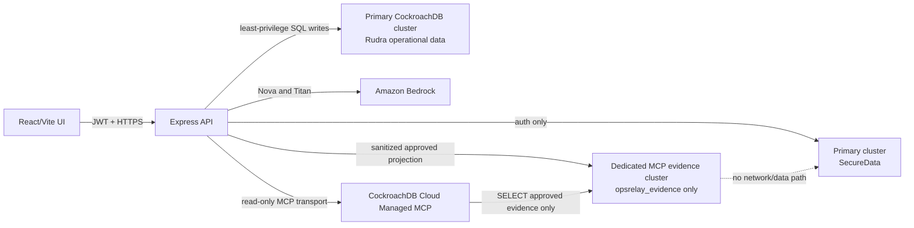

# OpsRelay Security, Durable Intake, and Managed MCP Implementation Plan

**Prepared:** August 2, 2026  
**Repository:** `RudraYBedekar/OPSRelay`  
**Reviewed baseline:** `d2a43aae82e0fdd5bcd98bb0b6a39c975d5ff692`  
**Document purpose:** implementation handoff for the five changes below. This document does not apply migrations or change application behavior.

## 1. Required outcomes

This milestone must deliver all five outcomes together:

1. An authenticated user cannot read, match, suppress, resolve, or override another user's alert-fatigue records.
2. Raw incident notes are saved before any Bedrock or Titan call. If AI analysis fails, the incident remains retrievable and can be retried.
3. CockroachDB Cloud Managed MCP performs a real, read-only investigation against approved evidence.
4. The UI shows real MCP evidence and citations. It must not invent postmortem IDs, dates, runbook URLs, or source names.
5. Automated and controlled integration tests prove that the MCP path cannot write and cannot access credentials, raw notes, or another cluster.

These changes provide the intended hackathon story:

> OpsRelay saves incident evidence first, uses Bedrock to create a human-reviewed incident record, stores reusable vector memory in CockroachDB, and uses CockroachDB Managed MCP to investigate sanitized historical evidence without write access.

## 2. Current implementation and confirmed gaps

### 2.1 Alert Fatigue is globally scoped

The current `alert_embeddings` table in `server/schemaAlertFatigue.sql` has no owner or tenant column. The following operations search or mutate records only by service, incident ID, or alert ID:

- `searchSimilarAlerts()` in `server/services/alertFatigueService.ts`
- `evaluateAlert()` in `server/services/alertFatigueService.ts`
- `getAlertStatsForIncident()` in `server/services/alertFatigueService.ts`
- `getAlertById()` and `markAlertAsNoise()` in `server/services/alertFatigueService.ts`
- `POST /api/alerts/:alertId/mark-noise` in `server/routes/alerts.ts`
- `POST /api/alerts/:alertId/override-distinct` in `server/routes/alerts.ts`
- `GET /api/alerts/incident/:incidentId/stats` in `server/routes/alerts.ts`

Every route is behind JWT authentication, but authentication alone is not authorization. A logged-in user who knows or guesses an alert or incident ID can affect global alert state. `evaluateAlert()` can also return the matched record's `alertText`, which can disclose another user's incident content.

### 2.2 AI extraction happens before incident persistence

The current frontend calls `POST /api/extract` from `handleRunExtraction()` in `src/App.tsx`. Only after successful extraction and human review does it call `POST /api/incidents`.

Consequences:

- If Bedrock fails, the user's report exists only in browser state.
- Refreshing or closing the page can lose the report.
- `POST /api/incidents` calls Titan-powered alert evaluation before inserting the incident. A Titan, alert-table, or vector-index failure can therefore also prevent persistence.
- Vector indexing and alert recording happen as untracked fire-and-forget promises after the insert. Failures are logged but cannot be retried reliably.

### 2.3 MCP is documentation-only

`.agents/mcp.json.example` is a development-tool connection example. The running Express application does not contain an MCP client, investigator route, evidence contract, citation model, or read-only verification.

The current `docs/COCKROACHDB_SETUP.md` also describes approving read/write access and running administrative requests. That is incompatible with the read-only investigator required by this milestone.

### 2.4 Existing citations are not trustworthy

`server/routes/memory.ts` constructs postmortem identifiers, dates, and internal runbook URLs that are not backed by stored records. `src/components/agent/AgentConsole.tsx` converts agent matches into cards with empty citations and a generated current date.

MCP citations must come from returned database rows and stable evidence identifiers. They must never be generated merely because a matching incident ID exists.

## 3. Target architecture



### Why use a separate MCP evidence cluster?

CockroachDB Managed MCP can be scoped to one cluster, not to one application user or one table. The current primary cluster contains both operational incident data and the `SecureData` database. Giving MCP read access to that cluster would make `SecureData`, raw notes, and other operational tables potentially discoverable.

For a truthful restricted-data test, the MCP connection should target a dedicated evidence cluster containing only sanitized, human-approved incident evidence. The primary backend remains responsible for every write. Managed MCP receives read-only authorization and never receives the primary application's SQL credential.

Do not label the integration safe if it is pointed at the current mixed-data cluster.

## 4. Security invariants

Implementation and review must treat these as non-negotiable contracts:

- `POST /api/incidents` performs no Bedrock, Titan, MCP, or external network call before committing the raw incident.
- Alert similarity is always filtered by `owner_member_id` before vector ranking.
- Alert read routes require `canViewIncident()`; alert mutations require `canEditIncident()`.
- Shared viewers may view authorized alert statistics, but cannot mark noise or override distinctness.
- Alert API responses never return stored raw alert text from a matched record.
- Model output remains a draft until the incident owner approves it.
- The browser never connects directly to CockroachDB or Managed MCP.
- MCP receives no `DATABASE_URL`, SQL password, JWT secret, AWS key, raw incident notes, user table, or auth audit table.
- The MCP application wrapper accepts an investigation intent, never arbitrary SQL from the browser or the model.
- Normal application writes use the backend SQL connection. MCP performs reads only.
- Every displayed citation is constructed from a row actually returned by MCP.
- A Bedrock, Titan, MCP, or evidence-projection failure must not delete or roll back a saved incident.

## 5. Prerequisite: versioned schema changes

The repository currently performs DDL during server startup from `server/index.ts`. Do not add the changes below to that pattern. Create versioned, reviewable migrations and run them with a separate migration-owner credential.

Suggested migration layout:

```text
server/migrations/
  20260802_001_alert_tenant_scope.sql
  20260802_002_agent_runs_and_jobs.sql
  20260802_003_mcp_evidence_schema.sql   # evidence cluster only
```

The runtime application user must have only the DML privileges it needs. It must not be able to create or alter tables, indexes, databases, users, roles, or grants.

Before applying any migration:

1. Inspect the target database, user, existing revision, row counts, and current grants.
2. Back up or confirm CockroachDB Cloud recovery coverage.
3. Run the migration first against a disposable or staging cluster.
4. Verify expected columns, indexes, constraints, and privileges.
5. Run application tests against the migrated staging database.
6. Obtain explicit approval before applying it to the live database.

## 6. Change 1: fix cross-user Alert Fatigue access

### 6.1 Data-model change

Add an ownership boundary to every alert row:

```sql
ALTER TABLE alert_embeddings
  ADD COLUMN owner_member_id STRING;

CREATE INDEX idx_alert_embeddings_owner_incident
  ON alert_embeddings (owner_member_id, linked_incident_id);

CREATE INDEX idx_alert_embeddings_owner_status
  ON alert_embeddings (owner_member_id, status, last_seen DESC);
```

Backfill only when the linked incident has a valid owner:

```sql
UPDATE alert_embeddings AS alert
SET owner_member_id = incident.data->>'ownerMemberId'
FROM incidents AS incident
WHERE alert.linked_incident_id = incident.id
  AND alert.owner_member_id IS NULL
  AND incident.data->>'ownerMemberId' IS NOT NULL;
```

Legacy rows that cannot be assigned safely must remain quarantined and excluded from all application queries. Do not guess an owner. After verifying that no unresolved rows remain, make the field non-null:

```sql
ALTER TABLE alert_embeddings
  ALTER COLUMN owner_member_id SET NOT NULL;
```

Replace the current vector index so its prefix matches the security and service filters:

```sql
DROP INDEX IF EXISTS idx_alert_embeddings_vector;

CREATE VECTOR INDEX idx_alert_embeddings_vector
  ON alert_embeddings (owner_member_id, service, embedding vector_cosine_ops);
```

The final migration must check the live CockroachDB version and syntax in staging before production use. Do not copy these statements directly into a production console without the readiness process.

### 6.2 Backend policy changes

#### `server/services/incidentAccessService.ts`

Add explicit alert authorization helpers:

```ts
export function canViewAlertForIncident(incident, viewer, grantedOwnerIds): boolean {
  return canViewIncident(incident, viewer, grantedOwnerIds);
}

export function canManageAlertForIncident(incident, viewer): boolean {
  return canEditIncident(incident, viewer);
}
```

Keep the policy centralized. Do not duplicate owner comparisons inside routes.

#### `server/services/alertFatigueService.ts`

Change every service method to require an owner scope:

```ts
searchSimilarAlerts(alertText, service, ownerMemberId)
evaluateAlert(alertText, service, ownerMemberId, options)
recordAlertForIncident(alertText, service, incidentId, ownerMemberId)
getAlertStatsForIncident(incidentId, ownerMemberId)
getAlertByIdForOwner(alertId, ownerMemberId)
markAlertAsNoise(alertId, ownerMemberId)
markAlertDistinct(alertId, ownerMemberId)
```

Every SQL statement must contain an ownership predicate. Examples:

```sql
WHERE owner_member_id = $3
  AND service = $2
```

```sql
UPDATE alert_embeddings
SET status = 'noise', last_seen = now()
WHERE id = $1 AND owner_member_id = $2
RETURNING id;
```

Treat an empty `RETURNING` result as not found. Never issue a second global lookup that reveals whether the ID exists for another user.

Return a safe match object that excludes `alertText`:

```ts
interface AlertMatchSummary {
  id: string;
  linkedIncidentId?: string;
  service: string;
  firstSeen: string;
  lastSeen: string;
  suppressedCount: number;
  status: AlertStatus;
  similarity: number;
}
```

#### `server/routes/alerts.ts`

For `GET /incident/:incidentId/stats`:

1. Load the incident.
2. Return `404` if it does not exist or is not visible to the current user.
3. Derive the owner from the stored incident, never from request input.
4. Query statistics with that owner scope.

For `mark-noise` and `override-distinct`:

1. Load the alert through an owner-scoped query.
2. Load its linked incident.
3. Require `canEditIncident()`.
4. Return `404` for unauthorized users to avoid ID enumeration.
5. Call a service method; remove the direct SQL update currently inside the route.

For `POST /evaluate`:

- Prefer removing it from the public API and performing evaluation only for a saved incident.
- If retained, require an `incidentId`, load that incident, require edit access, and derive service/text/owner from the stored incident.
- Never accept an owner ID or stored alert ID as an authorization boundary from the browser.

### 6.3 Alert behavior after save-first intake

Alert Fatigue must become advisory instead of destructive:

- Save the incident first.
- Evaluate duplicate likelihood after the commit.
- If a duplicate is found, mark the incident as `duplicate_candidate` and let the owner choose `Merge with existing` or `Keep distinct`.
- Do not return a pre-save `409` that discards the user's report.
- Do not automatically suppress incidents merely because a similar historical alert is resolved.

Replace the current `AlertSuppressedError` flow with a normal response status:

```ts
interface DuplicateCandidate {
  state: 'none' | 'checking' | 'candidate' | 'confirmed-distinct' | 'merged' | 'failed';
  matchedIncidentId?: string;
  similarity?: number;
  message?: string;
}
```

### 6.4 Frontend changes

Update:

- `src/types/alertFatigue.ts`
- `src/components/alerts/AlertSuppressedBanner.tsx`
- `src/components/alerts/AlertFatigueCard.tsx`
- `src/services/crdbClient.ts`
- `src/services/apiService.ts`
- `src/App.tsx`

Rename the user-facing concept from “incident suppressed” to “possible duplicate.” The UI must make clear that the incident is already saved.

### 6.5 Required Alert Fatigue tests

Add unit and route tests covering:

1. Owner can view statistics and mark their alert as noise.
2. Shared viewer can view the incident's allowed alert summary but cannot mutate it.
3. Unrelated user receives `404` for stats, mark-noise, and override-distinct.
4. An owner evaluating a similar alert never matches another owner's vector row.
5. A guessed alert ID does not reveal whether another user's row exists.
6. Matched API responses never contain stored `alertText` or raw notes.
7. An unowned legacy row never participates in similarity search.
8. Admin behavior is explicit and tested according to the chosen policy.

## 7. Change 2: save incidents before Bedrock analysis

### 7.1 New state machine

Use separate persistence and analysis states:

```text
SAVED / not_started
        |
        v
SAVED / running
   |              |
   v              v
SAVED / failed    SAVED / review_required
   |                         |
 retry                       v
                    SAVED / approved
                              |
                              v
                    vector/alert jobs retry independently
```

The incident's existence must never depend on the analysis state.

### 7.2 New tables

Create `agent_runs` for AI audit and idempotency:

```sql
CREATE TABLE agent_runs (
  id                  STRING PRIMARY KEY DEFAULT gen_random_uuid()::STRING,
  incident_id         STRING NOT NULL REFERENCES incidents (id),
  owner_member_id     STRING NOT NULL,
  run_type            STRING NOT NULL,
  status              STRING NOT NULL,
  idempotency_key     STRING NOT NULL,
  model_id            STRING,
  prompt_version      STRING,
  output_json         JSONB,
  confidence          DECIMAL,
  warnings            JSONB NOT NULL DEFAULT '[]',
  provider_request_id STRING,
  input_tokens        INT,
  output_tokens       INT,
  latency_ms          INT,
  error_code          STRING,
  created_at          TIMESTAMPTZ NOT NULL DEFAULT now(),
  completed_at        TIMESTAMPTZ,
  approved_at         TIMESTAMPTZ,
  UNIQUE (owner_member_id, idempotency_key)
);

CREATE INDEX idx_agent_runs_incident
  ON agent_runs (incident_id, created_at DESC);
```

Do not store the raw prompt, raw model response, credentials, or connection details in this table.

Create a durable outbox for non-critical post-save work:

```sql
CREATE TABLE incident_jobs (
  id              STRING PRIMARY KEY DEFAULT gen_random_uuid()::STRING,
  incident_id     STRING NOT NULL REFERENCES incidents (id),
  job_type        STRING NOT NULL,
  status          STRING NOT NULL DEFAULT 'pending',
  attempt_count   INT NOT NULL DEFAULT 0,
  next_attempt_at TIMESTAMPTZ NOT NULL DEFAULT now(),
  last_error_code STRING,
  created_at      TIMESTAMPTZ NOT NULL DEFAULT now(),
  updated_at      TIMESTAMPTZ NOT NULL DEFAULT now(),
  UNIQUE (incident_id, job_type)
);
```

Initial job types:

- `index_incident_vector`
- `evaluate_alert_duplicate`
- `project_mcp_evidence` after human approval

### 7.3 API contract

#### `POST /api/incidents`

Purpose: durable intake only.

Input:

```json
{
  "title": "Optional user title",
  "rawNotes": "Required incident or shift notes",
  "shareWithMemberId": "Optional member ID"
}
```

Behavior:

1. Authenticate the caller.
2. Validate request size and reject obvious credentials.
3. Redact supported secret patterns.
4. Generate the incident ID on the server.
5. Store a minimal incident with `analysisStatus: "not_started"`.
6. Commit.
7. Return `201` immediately.

No model or embedding call is allowed in steps 1–6.

Response:

```json
{
  "id": "INC-...",
  "status": "INVESTIGATING",
  "analysisStatus": "not_started",
  "savedAt": "..."
}
```

#### `POST /api/incidents/:id/analysis`

Require an `Idempotency-Key` header.

Behavior:

1. Load the incident and require edit permission.
2. Reuse and return the existing run for the same owner and idempotency key.
3. Insert an `agent_runs` row with `running` status.
4. Commit before calling Bedrock.
5. Call Bedrock Nova/Claude extraction outside a database transaction.
6. Validate the response with Zod.
7. Save the draft to `agent_runs.output_json` and set `review_required`.
8. On Bedrock, timeout, throttling, parsing, or validation failure, set the run to `failed` with a sanitized error code.
9. Never delete or roll back the incident.

#### `GET /api/incidents/:id/analysis/current`

Return only the latest authorized run's safe metadata, draft, confidence, and warnings.

#### `POST /api/incidents/:id/analysis/:runId/approve`

Input is the human-edited draft. The backend must validate it again.

In one CockroachDB transaction:

1. Lock/load the incident and analysis run.
2. Confirm both belong to the authenticated owner.
3. Reject a second approval with `409`.
4. Update the incident JSON with approved timeline, decisions, tasks, summary, severity, and service.
5. Mark the run `approved` and set `approved_at`.
6. Upsert the three `incident_jobs` rows.
7. Commit.

Titan indexing, alert evaluation, and MCP evidence projection execute after approval through the job worker. Their failures change job status, not incident persistence.

### 7.4 Backend file changes

#### Modify `server/routes/incidents.ts`

- Remove pre-insert `evaluateAlert()`.
- Remove post-insert fire-and-forget `indexIncident()` and `recordAlertForIncident()`.
- Restrict create input to intake fields instead of mass-assigning the complete client incident object.
- Insert only validated server-owned fields.

#### Add `server/routes/analysis.ts`

Implement the three analysis endpoints and mount them under protected `/api/incidents` routing or mount a dedicated `/api/analysis` router.

#### Add `server/services/analysisService.ts`

Responsibilities:

- idempotent run creation
- Bedrock invocation
- Zod validation
- sanitized audit metadata
- review/approval transaction

Do not place HTTP response logic in this service.

#### Add `server/services/incidentJobService.ts`

Responsibilities:

- enqueue with unique `(incident_id, job_type)`
- claim pending jobs safely
- bounded retry with jitter
- permanent failure after a configured maximum
- sanitized error codes

The worker must not log raw notes, embeddings, prompts, model output, or credentials.

#### Modify `server/services/vectorService.ts`

- Keep exact 1,024-dimension and finite-number validation.
- Make indexing idempotent by replacing an incident's chunks transactionally.
- Perform Bedrock embedding before opening the write transaction so a Cockroach retry does not repeat a paid external call.
- Mark the job successful only after the vector transaction commits.

### 7.5 Frontend workflow

Modify `src/App.tsx`, `src/components/intake/IntakePanel.tsx`, `NotesForm.tsx`, and `ExtractionResultView.tsx`:

1. User submits notes.
2. UI calls `POST /incidents` first.
3. Show “Incident saved” with the real server ID.
4. UI calls the analysis endpoint with a generated idempotency key.
5. Show analysis progress without hiding the saved incident.
6. If analysis fails, show `Retry analysis` and `Open saved incident`.
7. If analysis succeeds, show the editable draft.
8. Approve the edited draft through the approval endpoint.
9. Show independent statuses for vector indexing, alert evaluation, and MCP evidence readiness.
10. A refresh reconstructs the state using the incident and current-analysis endpoints.

Do not keep the current wording “AI extraction complete — review and save.” The correct wording is “Incident saved — AI draft ready for review.”

### 7.6 Required durable-intake tests

1. Mock Bedrock failure; `POST /incidents` still returns `201`, and `GET /incidents/:id` succeeds.
2. Mock Titan failure; the approved incident remains saved and the vector job is retryable.
3. Mock alert-table failure; the incident remains saved.
4. Duplicate idempotency key creates one `agent_runs` row and one Bedrock invocation.
5. Invalid model JSON never updates approved incident fields.
6. Duplicate approval returns `409` and creates no duplicate jobs.
7. Approval transaction rollback leaves the prior incident and run unchanged.
8. Refresh after Bedrock failure shows the saved incident and retry action.
9. Unauthorized user cannot analyze or approve another user's incident.
10. Logs and API errors contain no raw notes or provider response body.

## 8. Change 3: Managed MCP read-only investigator

### 8.1 What counts as a real integration

A config file used by Cursor is not sufficient. The running OpsRelay backend must call CockroachDB Cloud Managed MCP, receive database evidence, and return that evidence to an authenticated UI.

The MCP feature should answer bounded investigation questions such as:

- “Show unresolved incidents for this service.”
- “Which approved incident resolutions are relevant to this incident?”
- “What open follow-up tasks recur for this service?”
- “Explain the query plan used by the investigation.”

### 8.2 Evidence cluster and projection

Create a separate CockroachDB Cloud cluster for sanitized investigator evidence. Scope the MCP connection to this cluster using its cluster ID header.

Create one database, for example `opsrelay_evidence`, containing no credentials, users, auth logs, raw notes, chats, tokens, or secrets.

Suggested evidence table:

```sql
CREATE TABLE incident_evidence (
  incident_id       STRING PRIMARY KEY,
  title             STRING NOT NULL,
  service           STRING NOT NULL,
  severity          STRING NOT NULL,
  status            STRING NOT NULL,
  approved_summary  STRING NOT NULL,
  approved_resolution STRING,
  decision_summary  STRING,
  task_summary      STRING,
  source_updated_at TIMESTAMPTZ NOT NULL,
  evidence_version  INT NOT NULL DEFAULT 1,
  citation_id       STRING UNIQUE NOT NULL,
  projected_at      TIMESTAMPTZ NOT NULL DEFAULT now()
);

CREATE INDEX idx_evidence_service_status
  ON incident_evidence (service, status, source_updated_at DESC);
```

Projection rules:

- Project only human-approved incidents.
- Never project `rawNotes`, owner name/member ID, chat history, email, password hash, audit rows, tokens, or full model prompts.
- Redact again before projection.
- Use a stable citation ID such as `CRDB-EVIDENCE:<incident-id>:v<version>`.
- Upsert through a normal least-privilege SQL writer owned by the backend, not through MCP.
- If projection fails, keep the primary incident approved and retry the projection job.

### 8.3 Managed MCP authentication

Recommended for the hackathon demo:

1. Create a dedicated CockroachDB Cloud identity for the investigator connection.
2. Scope it only to the evidence cluster.
3. Use the Managed MCP OAuth flow and authorize **read only**, not read/write.
4. Store OAuth tokens outside the repository and encrypt them at rest.
5. Never place the token in `.env.example`, README, source code, terminal output, or Git history.

The official Managed MCP API-key flow derives permissions from a CockroachDB Cloud service account. Do not assume that a separate SQL user named `opsrelay_mcp_reader` automatically constrains Managed MCP; Managed MCP authentication and SQL-driver authentication are different systems.

If headless API-key authentication is chosen instead of OAuth, the team must first prove in staging that the service account cannot use `create_database`, `create_table`, or `insert_rows`. If it cannot be proven, do not deploy that credential in the product and do not claim least-privilege MCP.

### 8.4 Dependencies and configuration

Use the official Model Context Protocol TypeScript SDK rather than hand-writing JSON-RPC. Add the exact current compatible package version after testing it in a small spike.

Add only safe configuration names to `.env.example`:

```dotenv
MCP_ENABLED=false
MCP_SERVER_URL=https://cockroachlabs.cloud/mcp
MCP_CLUSTER_ID=
MCP_AUTH_MODE=oauth
MCP_EVIDENCE_DATABASE=opsrelay_evidence
MCP_QUERY_TIMEOUT_MS=10000
MCP_MAX_RESULTS=10
MCP_OAUTH_TOKEN_SECRET_ID=
EVIDENCE_DATABASE_URL=
```

`EVIDENCE_DATABASE_URL` is used only by the backend projection worker. It is not the Managed MCP credential. In production, use AWS Secrets Manager rather than a plaintext environment value.

### 8.5 Backend modules

Add:

```text
server/config/mcp.ts
server/mcp/managedMcpClient.ts
server/mcp/mcpToolPolicy.ts
server/mcp/investigationQueries.ts
server/routes/investigator.ts
server/services/investigatorService.ts
server/services/evidenceProjectionService.ts
server/schemas/investigator.ts
```

#### `server/config/mcp.ts`

Validate at startup:

- URL must be exactly the allowed HTTPS Managed MCP origin.
- Cluster ID is required when enabled.
- Result limit must be between 1 and 25.
- Timeout must be bounded.
- Production cannot enable MCP without a configured secure token provider.

Health must report only `not_configured`, `ready`, or `last_request_failed`. Never return tokens, cluster URLs with secrets, or provider response bodies.

#### `server/mcp/mcpToolPolicy.ts`

Use a deny-by-default tool policy:

```ts
const ALLOWED_MCP_TOOLS = new Set([
  'list_databases',
  'list_tables',
  'get_table_schema',
  'select_query',
  'explain_query',
]);

const DENIED_MCP_TOOLS = new Set([
  'create_database',
  'create_table',
  'insert_rows',
]);
```

Do not expose `show_running_queries` or broad `show_statement` to normal application users. The wrapper must reject unknown tools even if CockroachDB adds new ones later.

#### `server/mcp/investigationQueries.ts`

Do not send user-entered SQL to MCP. Create a small query catalog:

```ts
type InvestigationIntent =
  | 'service_history'
  | 'unresolved_incidents'
  | 'related_resolutions'
  | 'recurring_tasks';
```

Each intent maps to one reviewed `SELECT` statement that:

- reads only `opsrelay_evidence.public.incident_evidence`
- has an explicit `LIMIT`
- never includes multiple statements
- never includes comments or semicolons
- uses strictly validated values
- returns only citation-safe columns

The user's natural-language question may select an intent through validated model output, but it must never become SQL. Validate the intent with Zod and default to a safe supported intent.

#### `server/mcp/managedMcpClient.ts`

Responsibilities:

- connect through Streamable HTTP transport
- attach cluster scope and secure authorization
- enumerate tools once and verify policy
- execute only allowlisted tools
- enforce timeout and response-size limits
- validate response structures
- discard unexpected fields
- sanitize provider failures
- record request duration and tool name without recording SQL results or tokens

#### `server/services/investigatorService.ts`

Workflow:

1. Authenticate and authorize the OpsRelay user.
2. Validate question length and optional incident ID.
3. Load only the primary incident the user can view.
4. Convert the question into one allowed investigation intent.
5. Call one cataloged MCP `select_query`.
6. Validate and cap returned rows.
7. Construct citations directly from each row's `citation_id` and fields.
8. Ask Bedrock Nova to summarize only those evidence rows.
9. Validate that every referenced citation ID exists in the returned evidence set.
10. Return the answer, citations, tool metadata, and explicit read-only status.

If Nova fails, return the raw structured evidence cards with a message that narrative generation failed. MCP evidence should remain useful without Bedrock.

### 8.6 Investigator API

#### `GET /api/investigator/status`

Example safe response:

```json
{
  "status": "ready",
  "provider": "cockroachdb-cloud-managed-mcp",
  "readOnly": true,
  "evidenceDatabase": "opsrelay_evidence"
}
```

#### `POST /api/investigator/query`

Input:

```json
{
  "question": "What previous resolutions are relevant?",
  "incidentId": "INC-..."
}
```

Response:

```json
{
  "answer": "A previous approved incident used connection-pool tuning...",
  "readOnly": true,
  "provider": "cockroachdb-cloud-managed-mcp",
  "queryTemplateId": "related_resolutions_v1",
  "toolsUsed": ["select_query"],
  "citations": [
    {
      "citationId": "CRDB-EVIDENCE:INC-...:v1",
      "incidentId": "INC-...",
      "title": "Connection pool exhaustion",
      "service": "billing-service",
      "field": "approved_resolution",
      "excerpt": "Reduced pool contention by...",
      "source": "cockroachdb-managed-mcp",
      "retrievedAt": "..."
    }
  ]
}
```

Do not return the bearer token, cluster identifier, raw MCP protocol messages, unrestricted SQL, or stack traces.

### 8.7 Authorization model

For the first hackathon version, expose MCP investigation only to authenticated administrators or a dedicated `investigator` role. This avoids implying that a cluster-wide evidence corpus provides per-user row isolation.

If it later becomes a normal multi-tenant user feature, choose one of these designs:

- a separate evidence cluster per tenant; or
- a separate MCP connection whose accessible cluster contains only that tenant's evidence.

Application-side filtering after a cluster-wide MCP read is not an adequate security boundary.

## 9. Change 4: display real MCP citations in the UI

### 9.1 Type definitions

Add `src/types/investigator.ts`:

```ts
export interface McpCitation {
  citationId: string;
  incidentId: string;
  title: string;
  service: string;
  field: string;
  excerpt: string;
  source: 'cockroachdb-managed-mcp';
  retrievedAt: string;
}

export interface InvestigationResult {
  answer: string;
  readOnly: true;
  provider: 'cockroachdb-cloud-managed-mcp';
  queryTemplateId: string;
  toolsUsed: string[];
  citations: McpCitation[];
}
```

### 9.2 API client

Add to `src/services/crdbClient.ts` and `src/services/apiService.ts`:

- `getInvestigatorStatus()`
- `runMcpInvestigation(question, incidentId?)`

Use the existing JWT-bearing request wrapper. The frontend must call only the Express API.

### 9.3 Agent Console

Modify `src/components/agent/AgentConsole.tsx`:

- Add a clear mode control: `Vector memory` and `MCP investigator`.
- Show a `CockroachDB MCP · Read only` badge only when the status endpoint reports ready.
- Call `/api/investigator/query` in MCP mode.
- Preserve `incidentId` linking.
- Render returned citations beneath the answer.
- Show `No approved MCP evidence found` when the citation list is empty.
- Show a retryable error state if MCP is unavailable.
- Never silently fall back to vector mode while still labeling the answer MCP.

Add `src/components/agent/McpCitationCard.tsx` with:

- stable citation ID
- incident ID and title
- service
- exact evidence field
- bounded excerpt
- retrieval timestamp
- Open incident action only when the current user can access that incident in the primary application

### 9.4 Incident detail entry point

Modify `src/components/detail/IncidentDetailView.tsx` and `src/App.tsx`:

- Add `Investigate with MCP` for users with the investigator role.
- Navigate to Agent Console with the incident ID already selected.
- Do not send raw notes to MCP.

### 9.5 Remove fabricated evidence

Update `server/routes/memory.ts` and local fallback code in `src/services/apiService.ts`:

- remove fabricated postmortem IDs
- remove generated internal runbook URLs
- remove generated resolved dates
- remove claims about corpus sizes that are not queried
- label keyword/local results accurately

Vector-memory cards and MCP citations are different evidence types and must be displayed as such.

## 10. Change 5: prove MCP cannot write or access restricted data

### 10.1 Test layers

#### Unit tests

Test `mcpToolPolicy.ts`:

- allow approved read tools
- deny `create_database`, `create_table`, and `insert_rows`
- deny unknown future tools
- reject multiple SQL statements
- reject unapproved database, schema, or table names
- reject mutation keywords in a query template

Test citation validation:

- every answer citation ID must exist in returned rows
- unknown citations are removed or cause validation failure
- excerpt length is bounded
- raw notes and restricted fields are rejected from the evidence schema

#### API tests with a fake MCP gateway

Add dependency injection so route tests can use a fake `McpGateway`.

Test:

1. Unauthenticated request returns `401`.
2. Non-investigator role returns `403`.
3. Allowed query returns citations.
4. MCP timeout returns a sanitized `503`.
5. Bedrock failure still returns structured MCP evidence.
6. Fake MCP response containing `password_hash`, `rawNotes`, or token-like content is rejected/redacted.
7. The API never accepts `sql`, `toolName`, `database`, or `clusterId` from the browser.

#### Controlled staging integration tests

Run these only against the dedicated evidence staging cluster, never the live primary cluster.

1. Confirm `list_databases` returns only expected evidence/default databases and not `SecureData`.
2. Confirm a scoped request using another cluster ID fails.
3. Confirm `select_query` can read `incident_evidence`.
4. Confirm `select_query` cannot read `SecureData.public.users` because that database does not exist in the evidence cluster.
5. Confirm write tools are unavailable or authorization-denied under the read-only OAuth scope.
6. Use a harmless staging-only `mcp_write_probe` table to verify a denied insert leaves its row count unchanged.
7. Confirm the MCP connection cannot create a table or database.
8. Confirm no response contains secrets or raw notes.

The write-denial test must have two safeguards:

- an environment assertion that the cluster is the dedicated staging evidence cluster; and
- a separate read-only count before and after the denied operation.

Never run a write probe against the primary or production cluster.

### 10.2 Suggested test files

```text
server/tests/alertAuthorization.test.ts
server/tests/durableIntake.test.ts
server/tests/analysisIdempotency.test.ts
server/tests/mcpToolPolicy.test.ts
server/tests/investigatorRoute.test.ts
server/tests/mcpSecurity.integration.test.ts
src/components/agent/McpCitationCard.test.tsx
src/components/agent/AgentConsole.test.tsx
```

Add `supertest` and a React testing stack if they are not already present. Keep production integrations behind interfaces so tests never need real Bedrock, MCP, or CockroachDB unless explicitly running the staging integration suite.

## 11. File-by-file implementation map

| File | Action | Main change |
|---|---|---|
| `server/schemaAlertFatigue.sql` | Replace with migration-owned schema definition | Add owner scope and owner-prefixed vector index |
| `server/services/alertFatigueService.ts` | Modify | Owner-scoped queries; safe summaries; no global updates |
| `server/routes/alerts.ts` | Modify | Incident authorization; owner/edit checks; no direct SQL |
| `server/services/incidentAccessService.ts` | Modify | Central alert view/manage policy |
| `server/routes/incidents.ts` | Refactor | Persist first; no external calls before commit |
| `server/routes/analysis.ts` | Add | Analyze/current/approve endpoints |
| `server/services/analysisService.ts` | Add | Runs, validation, idempotency, approval |
| `server/services/incidentJobService.ts` | Add | Durable retryable post-save jobs |
| `server/services/vectorService.ts` | Modify | External call outside transaction; idempotent indexing |
| `server/services/evidenceProjectionService.ts` | Add | Sanitize and upsert approved evidence |
| `server/config/mcp.ts` | Add | Fail-closed MCP configuration |
| `server/mcp/managedMcpClient.ts` | Add | MCP SDK transport and response validation |
| `server/mcp/mcpToolPolicy.ts` | Add | Deny-by-default read tool allowlist |
| `server/mcp/investigationQueries.ts` | Add | Fixed reviewed query catalog |
| `server/services/investigatorService.ts` | Add | Evidence retrieval, Nova synthesis, citations |
| `server/routes/investigator.ts` | Add | Authenticated status/query endpoints |
| `server/schemas/investigator.ts` | Add | Zod request, evidence, and response schemas |
| `server/index.ts` | Modify | Mount investigator; remove runtime DDL calls after migrations are established |
| `src/types/alertFatigue.ts` | Modify | Safe duplicate-candidate contract |
| `src/types/investigator.ts` | Add | MCP result and citation contracts |
| `src/services/crdbClient.ts` | Modify | Analysis and investigator API calls |
| `src/services/apiService.ts` | Modify | New save-first flow; truthful local fallback |
| `src/App.tsx` | Modify | Orchestrate save, analyze, review, approve, investigate |
| `src/components/intake/*` | Modify | Saved-first progress and failure recovery |
| `src/components/alerts/*` | Modify | Possible-duplicate UI; saved state remains visible |
| `src/components/agent/AgentConsole.tsx` | Modify | MCP mode and citations |
| `src/components/agent/McpCitationCard.tsx` | Add | Evidence rendering |
| `src/components/detail/IncidentDetailView.tsx` | Modify | Investigate-with-MCP entry point |
| `.env.example` | Modify | Safe names only; no credential values |
| `.gitignore` | Verify | Ignore OAuth tokens, private MCP config, `.env*` except examples |
| `docs/COCKROACHDB_SETUP.md` | Rewrite relevant section | Read-only product MCP, not administrative IDE use |
| `README.md` | Modify after implementation | Describe only verified features and limitations |

## 12. Recommended implementation sequence

### Phase 1 — authorization boundary

1. Write alert authorization tests that reproduce the current vulnerability.
2. Add the owner-scope migration and backfill strategy.
3. Refactor alert service methods.
4. Add route-level view/edit checks.
5. Remove raw matched alert text from responses.
6. Run unit, route, build, and lint checks.

**Exit condition:** another user cannot observe or mutate an owner's alert state, including through vector matching.

### Phase 2 — durable save-first intake

1. Add `agent_runs` and `incident_jobs` migrations.
2. Reduce `POST /incidents` to durable intake.
3. Add analysis and approval endpoints.
4. Add job worker and retry states.
5. Update frontend flow and refresh recovery.
6. Test Bedrock, Titan, and alert failures.

**Exit condition:** a deliberately failing Bedrock mock cannot cause an incident report to disappear.

### Phase 3 — evidence projection

1. Create the dedicated evidence staging cluster.
2. Apply the evidence schema with a migration owner.
3. Create a least-privilege backend evidence writer.
4. Implement sanitized projection after approval.
5. Verify raw notes and SecureData never appear in evidence.

**Exit condition:** approved demo incidents appear as sanitized evidence rows; sensitive fields do not.

### Phase 4 — Managed MCP backend

1. Complete a small SDK connection spike.
2. Configure single-cluster, read-only OAuth.
3. Implement tool policy and query catalog.
4. Implement status and investigation routes.
5. Add Nova synthesis with citation validation.
6. Run controlled MCP security tests.

**Exit condition:** a real Managed MCP `select_query` returns evidence while write and restricted-data probes fail safely.

### Phase 5 — UI citations and demo polish

1. Add MCP mode to Agent Console.
2. Add citation cards and incident entry point.
3. Remove fabricated citation behavior.
4. Test loading, empty, error, keyboard, mobile, and refresh states.
5. Record the final architecture and demo evidence.

**Exit condition:** a judge can see the exact Managed MCP source rows behind the answer.

## 13. Verification commands

Run safe local checks after implementation:

```bash
npm test
npm run lint
npm run build:server
npm run build
```

Add dedicated scripts:

```json
{
  "test:security": "vitest run server/tests/alertAuthorization.test.ts server/tests/mcpToolPolicy.test.ts",
  "test:integration": "vitest run --config vitest.integration.config.ts",
  "mcp:smoke:readonly": "tsx server/scripts/mcpReadonlySmokeTest.ts"
}
```

The MCP smoke test must:

- require an explicit staging-only flag;
- print tool names and pass/fail results, not credentials or row content;
- fail if write tools succeed;
- fail if the primary cluster or `SecureData` is visible;
- never modify production.

## 14. Observability and failure handling

Record safe metadata for analysis and MCP calls:

- request/correlation ID
- authenticated member ID hash or internal ID, not email
- incident ID
- operation type
- provider/model/tool name
- prompt/query-template version
- latency
- token counts when available
- success/failure status
- sanitized error code

Never log:

- raw notes
- raw prompts or full model output
- MCP result rows
- embeddings
- OAuth/API tokens
- database URLs
- passwords, hashes, JWTs, or AWS credentials

Suggested health states:

- Bedrock: `not_configured`, `ready`, `last_request_failed`
- MCP: `not_configured`, `ready`, `last_request_failed`
- Vector job: `pending`, `running`, `complete`, `failed`
- Evidence projection: `pending`, `running`, `complete`, `failed`

## 15. Demo acceptance scenario

Use synthetic, non-sensitive incident notes.

1. Submit notes from the Incident Intake screen.
2. Immediately show the saved incident ID.
3. Simulate or explain that the record survives even if Bedrock fails.
4. Run analysis and approve the edited draft.
5. Show the 1,024-dimension CockroachDB vector-memory status.
6. Create or open a second related incident.
7. Click `Investigate with MCP`.
8. Show the read-only badge, Managed MCP tool name, and real citation cards.
9. Open a cited incident.
10. Show a prepared security-test result proving write tools and restricted-data access were denied.

This demonstrates the two CockroachDB capabilities separately:

1. Distributed Vector Indexing for semantic memory.
2. CockroachDB Cloud Managed MCP for read-only evidence investigation.

Amazon Bedrock supplies the required AWS capability through structured analysis, Titan embeddings, and Nova evidence synthesis.

## 16. Definition of done

Do not mark this milestone complete until every item is true:

- [ ] Alert rows have a valid owner boundary.
- [ ] Every alert `SELECT` and `UPDATE` is owner-scoped.
- [ ] Shared viewers cannot mutate alert state.
- [ ] Matched alerts never disclose raw alert text.
- [ ] Incident save commits before Bedrock, Titan, or MCP calls.
- [ ] Bedrock failure leaves a retrievable incident.
- [ ] Analysis retry is idempotent.
- [ ] Approval is human-controlled and transactionally persisted.
- [ ] Vector, alert, and evidence jobs are durable and retryable.
- [ ] MCP targets a dedicated sanitized evidence cluster.
- [ ] MCP connection is single-cluster scoped and read-only.
- [ ] Browser communicates only with Express.
- [ ] MCP wrapper denies write and unknown tools.
- [ ] Restricted-data tests pass.
- [ ] Citations correspond to actual MCP rows.
- [ ] Fabricated citations and runbook URLs are removed.
- [ ] Unit, route, integration, frontend, lint, and build checks pass.
- [ ] No secret or private MCP config is tracked by Git.
- [ ] Documentation matches the verified implementation.

## 17. Important risks and decisions

### Managed MCP and least privilege

Managed MCP authentication uses CockroachDB Cloud OAuth or service-account API keys. It is not the same as connecting with a restricted SQL user through `DATABASE_URL`. Test the exact authorization behavior rather than assuming a SQL grant applies to MCP.

### Multi-user evidence

A single cluster-wide MCP connection is not a safe per-user row-security mechanism. For the hackathon, restrict investigation to administrators and sanitized approved demo evidence. A production multi-tenant design needs stronger physical tenancy boundaries.

### Runtime migrations

The five requested changes need schema updates. Do not extend the current startup-DDL approach. Establish versioned migrations and a migration-owner workflow before live rollout.

### Scope discipline

Do not combine this milestone with unrelated Commander, chat, visual redesign, or deployment rewrites. Security boundaries, persistence behavior, trustworthy evidence, and tests are the priority.

## 18. References

- [CockroachDB Cloud Managed MCP documentation](https://www.cockroachlabs.com/docs/cockroachcloud/connect-to-the-cockroachdb-cloud-mcp-server)
- [CockroachDB Cloud access management](https://www.cockroachlabs.com/docs/cockroachcloud/managing-access)
- [CockroachDB and AWS hackathon rules](https://cockroachdb-ai.devpost.com/rules)
- [Amazon Titan Text Embeddings V2](https://docs.aws.amazon.com/bedrock/latest/userguide/titan-embedding-models.html)

