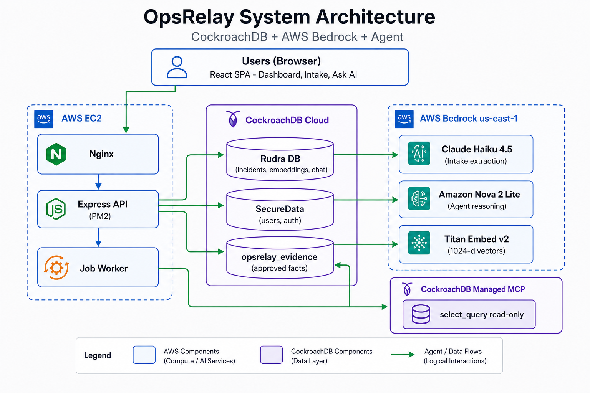
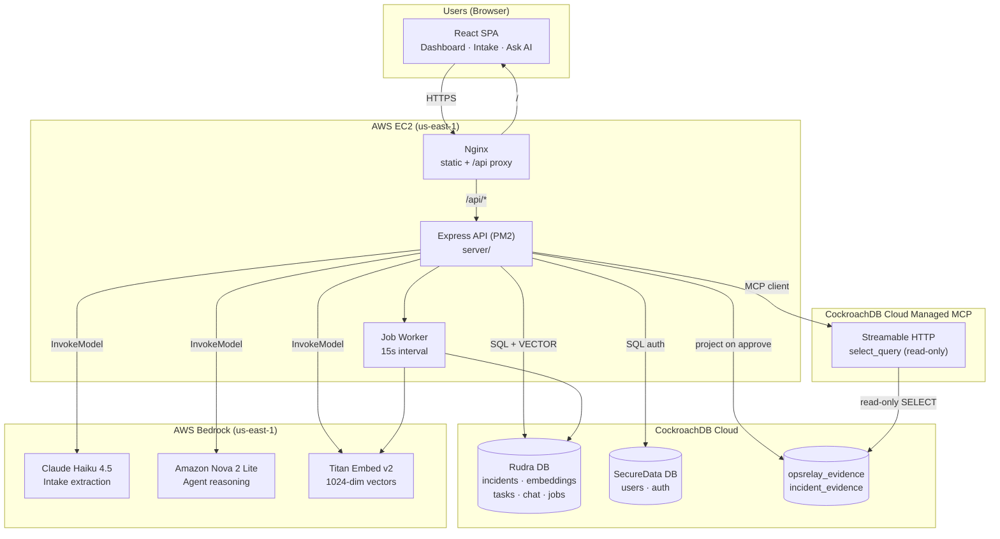
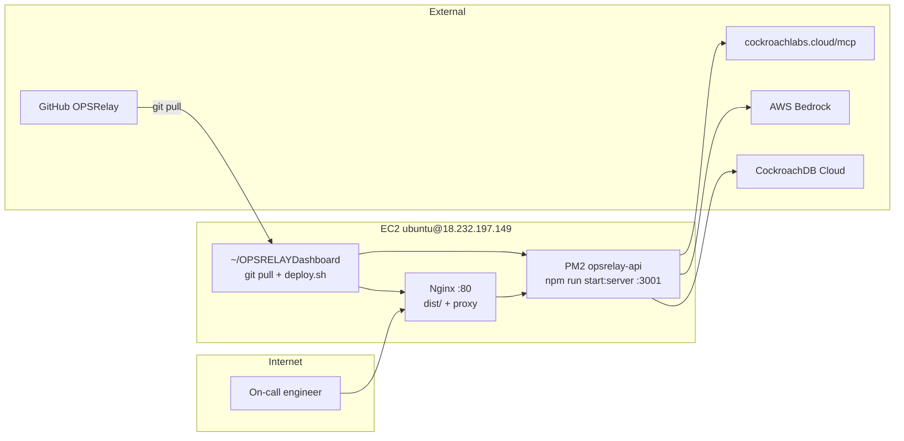
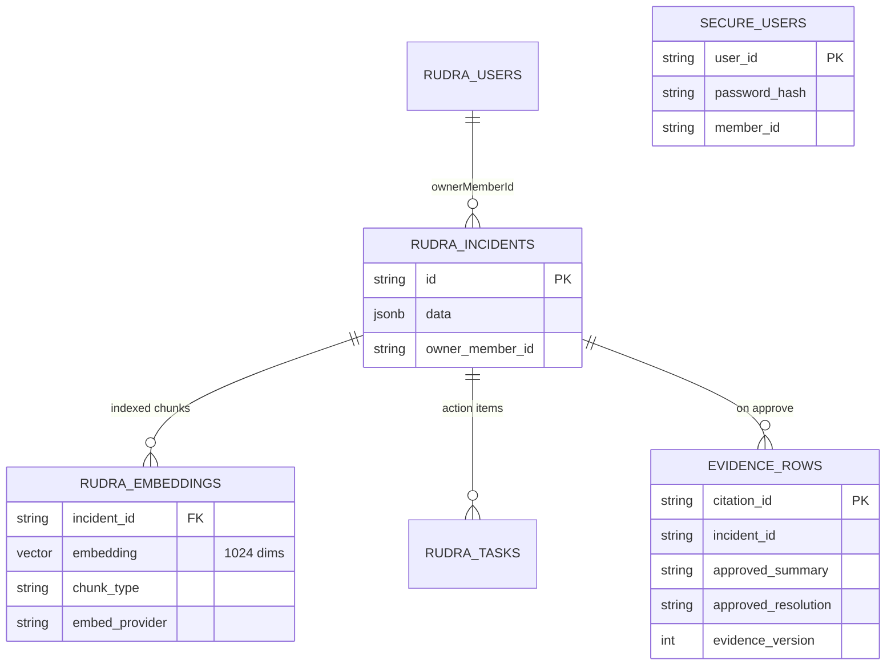
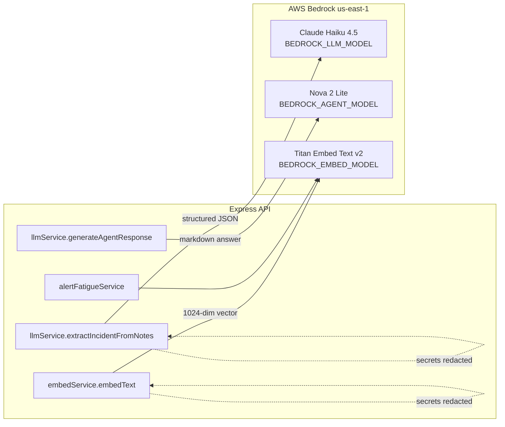
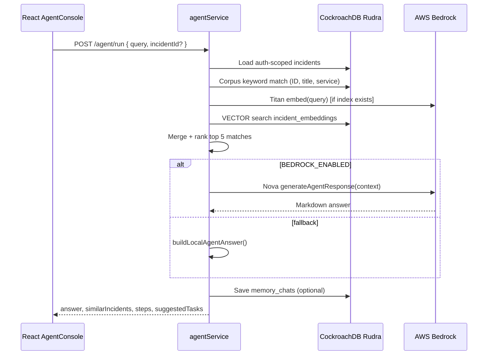
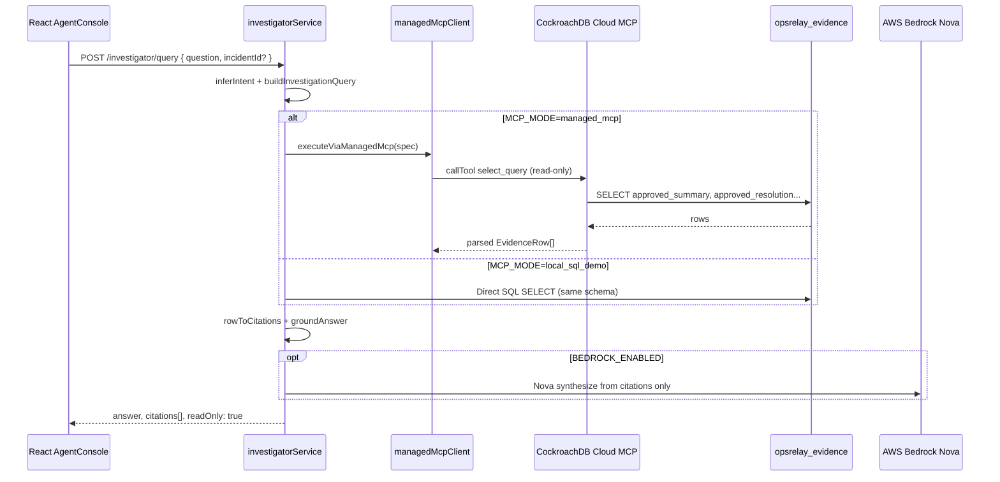
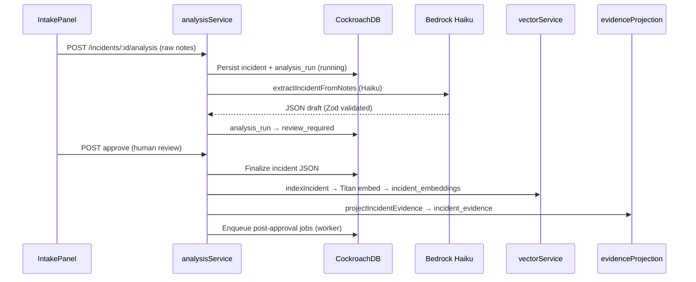
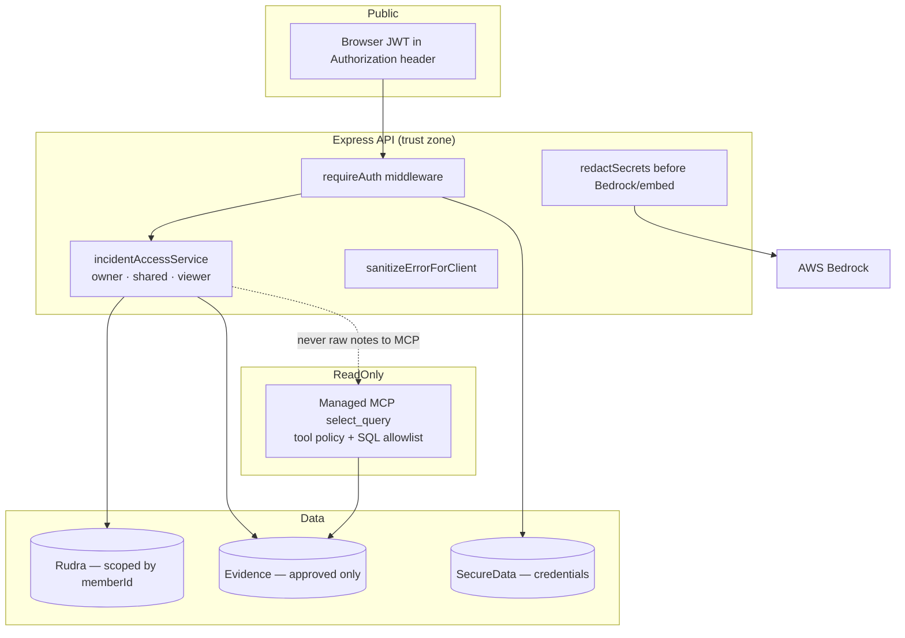

# OpsRelay — System Architecture

This document describes how **CockroachDB**, **AWS services**, and the **OpsRelay agent** interact in production. It reflects the deployed stack at `http://18.232.197.149/` (EC2 + Nginx + PM2).

---

## 1. Executive summary

OpsRelay is a full-stack incident-response platform:

| Layer | Technology | Role |
|-------|------------|------|
| **Client** | React + Vite | Dashboard, intake, Ask AI, task board |
| **API** | Express (Node.js) | Auth, REST, agent orchestration, job worker |
| **Primary data** | CockroachDB Cloud (`Rudra`) | Incidents, vectors, chat, metrics, jobs |
| **Credentials** | CockroachDB Cloud (`SecureData`) | Users, passwords (bcrypt), JWT identity |
| **Evidence store** | CockroachDB (`opsrelay_evidence`) | Human-approved summaries for MCP queries |
| **AI** | AWS Bedrock (us-east-1) | Extraction, reasoning, embeddings |
| **Investigator** | CockroachDB Cloud Managed MCP | Read-only `select_query` over evidence |

The agent is **not a separate microservice**. It runs inside the Express API as `agentService` (vector memory) and `investigatorService` (MCP evidence), calling Bedrock and CockroachDB through shared services.



---

## 2. High-level system context



---

## 3. Deployment topology



**Deploy path:** `git push` → EC2 `git pull` → `npm run build` → PM2 restart → Nginx serves `dist/`.

---

## 4. CockroachDB data architecture

OpsRelay uses **two logical databases** plus an **evidence projection**:



| Database | Key tables | Access |
|----------|------------|--------|
| **Rudra** | `incidents`, `incident_embeddings`, `alert_embeddings`, `dashboard_metrics`, `memory_chats`, `analysis_runs`, `incident_jobs` | Express `pool` — read/write, auth-scoped |
| **SecureData** | `users` | Express `securePool` — auth only |
| **opsrelay_evidence** | `incident_evidence` | Written on analysis **approve**; read via MCP or local SQL demo |

**Vector search:** Titan embeddings stored in `incident_embeddings`. Queries use CockroachDB cosine distance with a 55% similarity threshold and auth-scoped incident IDs.

---

## 5. AWS Bedrock integration

All Bedrock calls go through `server/services/bedrockClient.ts` (`BedrockRuntimeClient` + `InvokeModelCommand`).



| Model | Env var | Used for |
|-------|---------|----------|
| Claude Haiku 4.5 | `BEDROCK_LLM_MODEL` | Paste logs → structured incident JSON (intake / analysis pipeline) |
| Amazon Nova 2 Lite | `BEDROCK_AGENT_MODEL` | Ask AI answers, MCP investigator synthesis |
| Titan Embed v2 | `BEDROCK_EMBED_MODEL` | Index incidents & alerts; query embedding for vector search |

Credentials: standard AWS SDK chain on EC2 (instance profile or env keys). Toggle: `BEDROCK_ENABLED=true`.

---

## 6. Agent architecture (two modes)

The **Ask AI** console exposes two agent paths:

### 6a. Vector memory agent (`POST /api/agent/run`)

Primary path for “Have we seen this before?”



**Key files:** `server/services/agentService.ts`, `server/services/vectorService.ts`, `server/services/llmService.ts`

### 6b. MCP investigator (`POST /api/investigator/query`)

Read-only evidence lookup with citation cards.



**Evidence pipeline:** When an operator **approves** AI extraction, `analysisService` calls `evidenceProjectionService.projectIncidentEvidence()` → rows in `incident_evidence` become MCP-queryable approved facts.

**Key files:** `server/services/investigatorService.ts`, `server/mcp/managedMcpClient.ts`, `server/mcp/investigationQueries.ts`

---

## 7. Incident intake & analysis pipeline



Background **job worker** (`server/services/jobWorker.ts`, 15s poll) processes embedding and alert-fatigue jobs asynchronously.

---

## 8. Security & trust boundaries



| Control | Implementation |
|---------|----------------|
| Authentication | JWT (`requireAuth` on `/api/*` except `/api/auth`, health) |
| Authorization | Per-incident owner/shared/viewer; investigator role gate |
| MCP | Read-only; `select_query` only; SQL allowlist on `incident_evidence` |
| Secrets | Stripped before LLM/embed; production requires Bedrock (no local embed) |
| Vector search | Results filtered to incidents the user may view |

---

## 9. API surface (agent-relevant)

| Endpoint | Service | Backend dependencies |
|----------|---------|----------------------|
| `POST /api/agent/run` | Vector memory agent | Rudra, Titan, Nova |
| `GET /api/agent/status` | Health | embedding count, Bedrock flag |
| `POST /api/agent/index` | Re-index (admin) | Titan → incident_embeddings |
| `POST /api/investigator/query` | MCP investigator | MCP or local SQL, Nova |
| `GET /api/investigator/status` | MCP probe | mcpConfig, last request status |
| `POST /api/incidents/.../analysis` | Intake AI | Haiku, Rudra |
| `GET /api/health` | Platform health | CRDB, Bedrock, MCP, vectors |

---

## 10. Configuration reference

```env
# CockroachDB
DATABASE_URL=postgresql://...@....cockroachlabs.cloud:26257/Rudra
SECURE_DATABASE_URL=postgresql://...@....cockroachlabs.cloud:26257/SecureData

# Frontend
VITE_USE_CRDB=true
VITE_API_URL=/api

# AWS Bedrock
BEDROCK_ENABLED=true
AWS_REGION=us-east-1
BEDROCK_LLM_MODEL=us.anthropic.claude-haiku-4-5-20251001-v1:0
BEDROCK_AGENT_MODEL=us.amazon.nova-2-lite-v1:0
BEDROCK_EMBED_MODEL=amazon.titan-embed-text-v2:0
BEDROCK_EMBED_DIMENSIONS=1024

# MCP investigator
MCP_MODE=managed_mcp          # or local_sql_demo | disabled
MCP_CLUSTER_ID=...
MCP_ACCESS_TOKEN=...
MCP_EVIDENCE_DATABASE=opsrelay_evidence
```

---

## 11. Related docs

- [DEMO_FLOW.md](./DEMO_FLOW.md) — Live demo script (vector + MCP talking points)
- [BEDROCK_VECTOR_SETUP.md](./BEDROCK_VECTOR_SETUP.md) — Bedrock and embedding setup
- [COCKROACHDB_SETUP.md](./COCKROACHDB_SETUP.md) — Cluster and schema
- [EC2_DEPLOY.md](./EC2_DEPLOY.md) — Production deploy
- [WHAT_WE_BUILT.md](./WHAT_WE_BUILT.md) — Feature summary

---

*Last updated: August 2026 — matches commit on `main` (OpsRelay Dashboard).*
